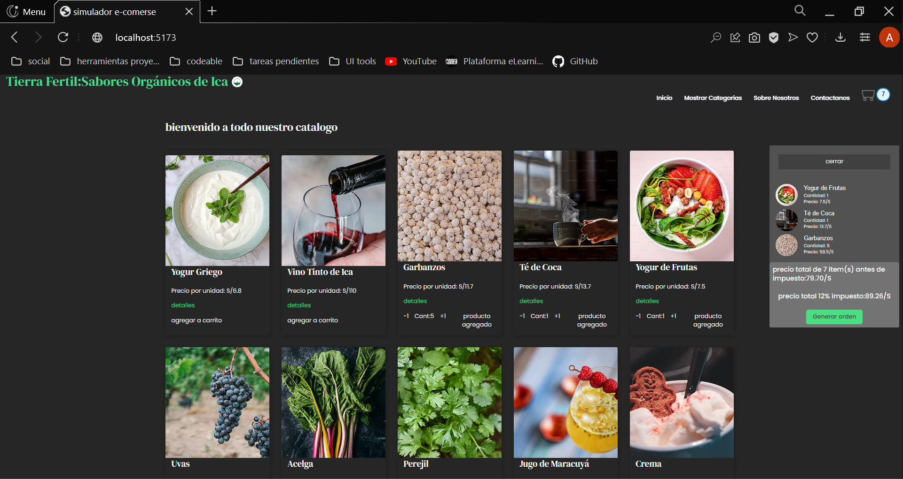
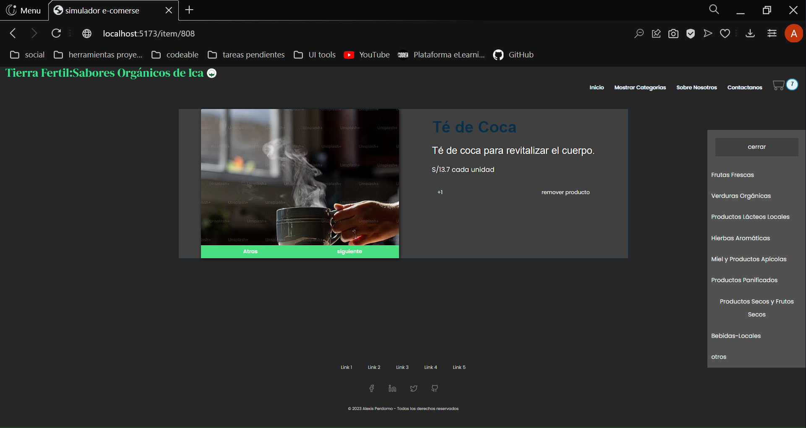

# Simulador E-comerse 

En el presente proyecto se pretende simular el funcionamiento y estructuración de un sitio web de caracter de comercio electronico. Decidi que la tematica seria dirigida a un negocio de tipo local el cual vende de manera electronica productos organicos principalmente a personas individuales. Para realizar esto se ha usado el framework React con el empaquetador vite entre otras librerias de las cuales dejo informacion debajo. 

## Tabla de Contenidos
- [Demo](#demo)
- [Capturas de Pantalla](#capturas-de-pantalla)
- [Características](#características)
- [Instalación](#instalación)
- [Tecnologías Utilizadas](#tecnologías-utilizadas)
- [Licencia](#licencia)

## Demo

utilizando la plataforma Netlify dejo adjunto un link donde poder ver el deploy del proyecto

https://comforting-travesseiro-5e8144.netlify.app

adicionalmente el repositorio 

https://github.com/AlexisPerdomoD/simulador-e_comerse


## Capturas de Pantalla





## Características

### Catálogo de Productos

- Visualiza un extenso catálogo de productos con detalles como nombre, descripción y precio.
- Las imágenes de los productos se muestran de forma atractiva para mejorar la experiencia del usuario.

### Gestión de Órdenes

- Agrega productos al carrito de compras de manera intuitiva.
- Visualiza el contenido actual del carrito de compras en cualquier momento.
- Modifica la cantidad de productos o elimina artículos del carrito de compras.

### Consultas a la Base de Datos

- Utiliza Firebase como base de datos para almacenar y gestionar el catálogo de productos.
- Realiza consultas específicas a la base de datos para obtener información detallada sobre los productos.

### Generación de Órdenes de Compra

- Crea órdenes de compra a partir de los productos seleccionados en el carrito.
- Envía consultas a la base de datos para almacenar de manera segura la información de la orden en Firebase.


### Firebase Integration

- Integra Firebase para el almacenamiento y gestión de datos.
- Utiliza Firebase Authentication para autenticar a los usuarios si es necesario.

### Consultas Específicas

- Realiza consultas específicas a la base de datos para obtener información detallada sobre los productos, como filtrar por categoría, precio, etc.

### Almacenamiento de Datos

- Almacena la información de las órdenes de compra de manera eficiente en Firebase.
- Garantiza la integridad y seguridad de los datos almacenados en la base de datos.


## Tecnologías Utilizadas

- React js
- Firebase / Firestore 
- react icons
- react-router-dom 
- vite


## Instalación
```bash
# Ejemplo de comandos de instalación
npm install
npm run dev